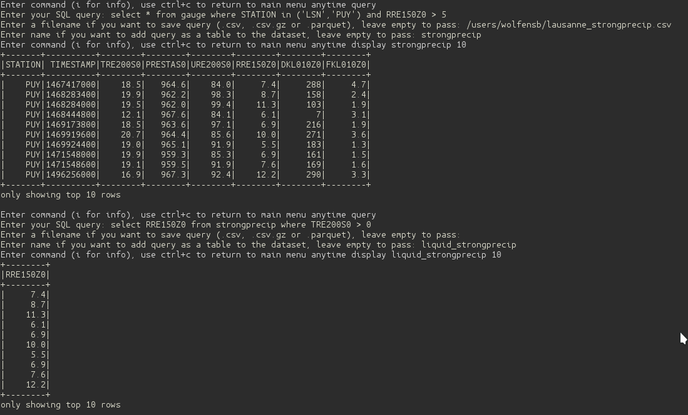
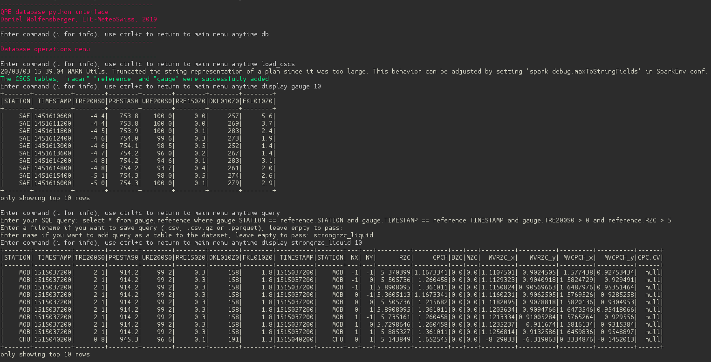

.. _Interface:

Interface
=======================================

The library provides a guided command-line interface that can be called by typing *rainforest_interface* in the console

.. code-block:: console

    rainforest_interface

The first example belows shows how to load a table into the database from files.

.. image:: load.png
    :align: center
    :alt: alternate text
    
   
The second example shows how to perform a SQL query from a the set of gauge data to select only strong precipitation. This query is then saved to a file and to memory, to be reused in a second query which extracts only precipitation measurements for positive temperatures

    
    
The third example shows how to load all three table types *radar*, *reference* and *gauge* at once on Kesch and how to do a more complex SQL query from multiple tables. In this case we retrieve the data from the *reference* and *gauge* tables, where RZC > 5 and where the temperature is positive.

    
The last example shows how to populate the database with new gauge data, as an alternative to the command line utility :ref:`db_populate`.

.. image:: populate.png
    :align: center
    :alt: alternate text   
   
   
