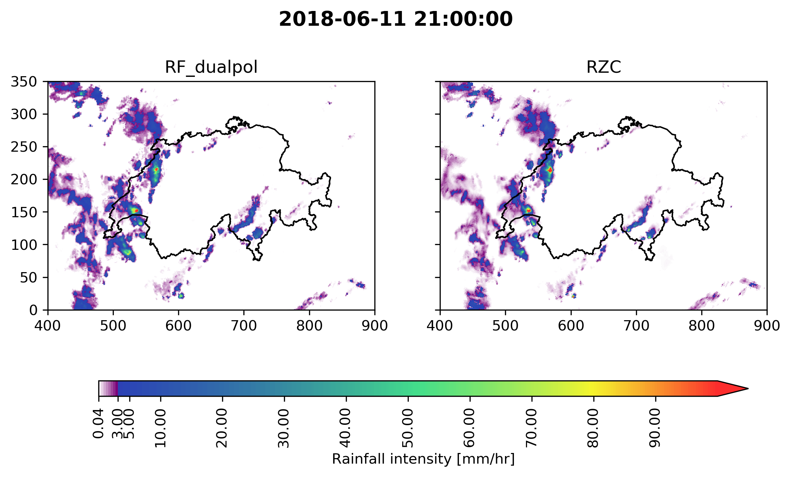
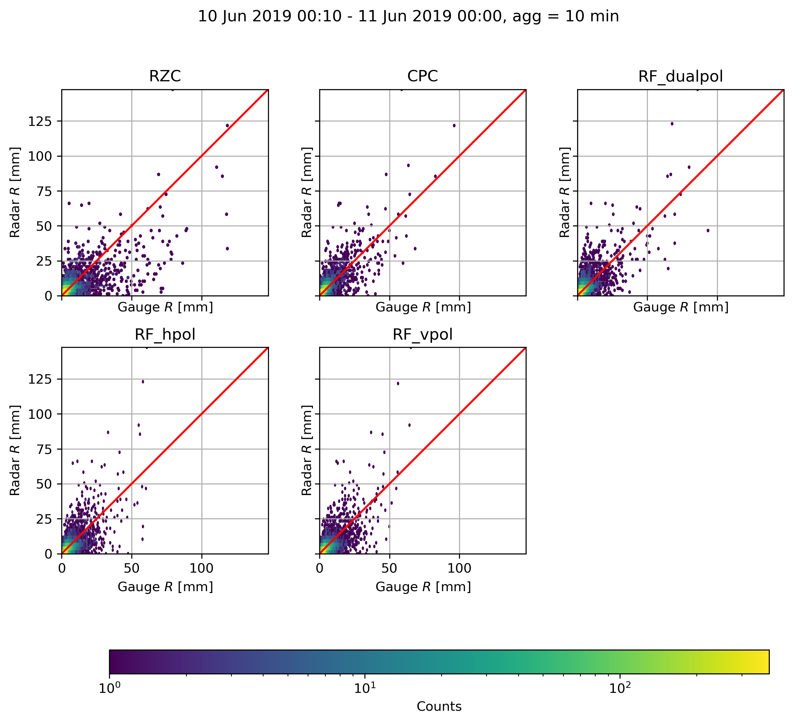
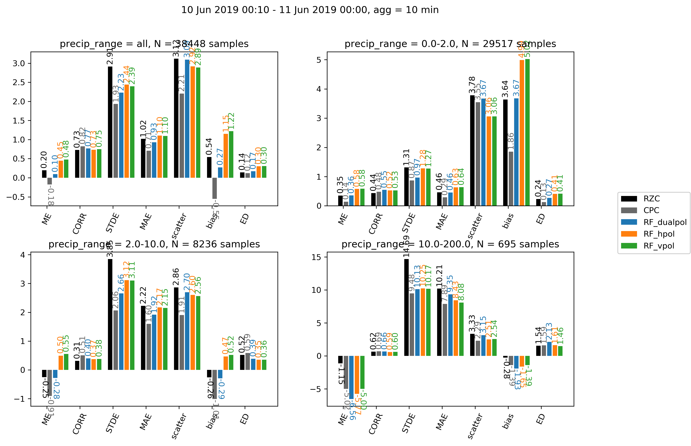

QPE command-line tools
=======================================

The *QPE* submodule has three easy to use command-line tools

#. :ref:`qpe_compute` 
#. :ref:`qpe_plot` 
#. :ref:`qpe_evaluation` 

.. _qpe_compute:

*qpe_compute*
-----------------

Computes the QPE estimates using the randomForest algorithm for a given time interval outputting the results in the form of a standard *640 x 710* pixels Cartesian map. Currently the output is written in binary format without any metadata.

**qpe_compute [options]**

Options:
  -h, --help            show this help message and exit
  -s START, --start=START
                        Specify the start time in the format YYYYddmmHHMM
  -e END, --end=END     Specify the end time in the format YYYYddmmHHMM
  -o OUTPUT, --output=OUTPUT
                        Path of the output folder, default is current folder
  -c CONFIG, --config=CONFIG
                        Path of the config file, the default will be
                        *default_config.yml* in the qpe module
  -m MODELS, --models=MODELS
                        Specify which models you want to use in the form of a
                        json line, the models must be in the folder
                        /qpe/rf_models/, for example
                        '{"RF_dualpol":"dualpol_model_BC_raw.p"}', please note
                        the double and single quotes, which are required
                    
The files will be written in the output folder, and a subfolder will be created for every model passed with the *-m* flag. For example '{"RF_dualpol":"dualpol_model_BC_raw.p","RF_hpol":"hpol_model_BC_raw.p"', will create two subfolders *RF_dualpol* and *RF_hpol*.

The configuration file must be written in `YAML <https://fr.wikipedia.org/wiki/YAML/>`_, the default file has the following structure:

.. code-block:: yaml

   TMP_FOLDER: '/scratch/wolfensb/'
   KDP_PARAMETERS:
       RMIN : 1000.
       RMAX : 50000.
       RCELL : 1000.
       ZMIN : 20.
       ZMAX : 40.
       RWIND : 6000.
   SNR_THRESHOLD: 3
   ZH_THRESHOLD: 7
   VISIB_CORR:
       MIN_VISIB: 37
       MAX_CORR: 2
   SWEEPS: 'all'
   RADARS: 'all'
   # Post-processing
   OUTLIER_REMOVAL: 1
   GAUSSIAN_SIGMA: 0.5
   ADVECTION_CORRECTION: 0
   FILE_FORMAT: DN

The parameters are the following

-   **TMP_FOLDER** : A directory where to store intermediate files generated during the processing, this is not important and */tmp/* can be used as well
-   **KDP_PARAMETERS** : set of parameters used in the computation of KDP using the moving least-square method. 

    -   **RMIN** : minimum range where to look for continuous precipitation, see `pyart code <https://github.com/meteoswiss-mdr/pyart/blob/master/pyart/correct/phase_proc.py>`_
    -   **RMAX** :  maximum range where to look for continuous precipitation, see `pyart code <https://github.com/meteoswiss-mdr/pyart/blob/master/pyart/correct/phase_proc.py>`_
    -   **ZMIN**  : minimum reflectivity to consider it a rain cell, see `pyart code <https://github.com/meteoswiss-mdr/pyart/blob/master/pyart/correct/phase_proc.py>`_
    -   **ZMAX**  : maximum reflectivity to consider it a rain cell, see `pyart code <https://github.com/meteoswiss-mdr/pyart/blob/master/pyart/correct/phase_proc.py>`_
    -   **RWIND** : size of the moving window in meters used in the PSIDP filtering and KDP estimation, see `pyart code <https://github.com/meteoswiss-mdr/pyart/blob/master/pyart/retrieve/kdp_proc.py>`_
-   **SNR_THRESHOLD** : minimum SNR in dB below which the radar data is masked 
-   **ZH_THRESHOLD** : minimum ZH below which radar data is masked
-   **VISIB_CORR** : set of parameters for visibility correction

    -   **MIN_VISIB** : minimum visibility below which the data is masked
    -   **MAX_CORR** : maximum visibility correction for ZH (in linear)
-   **SWEEPS** : which radar sweeps (elevations) to use, e.g. [1,2,3,4] for the 4 first, 'all' uses all 20 sweeps 
-   **RADARS** : which radars to consider, e.g. ['A','D'], 'all' uses all five radars
-   **OUTLIER_REMOVAL** : if set to 1, a local outlier filtering will be applied (e.g. remove values with z-scores in 3 x 3 window above +3 or below -3)
-   **GAUSSIAN_SIGMA** : size in pixels of the Gaussian smoothing that is applied on the QPE product, if set to 0 no smoothing is used
-   **ADVECTION_CORRECTION** : if set to 1, the QPE will be corrected for advection using `this method <https://journals.ametsoc.org/doi/pdf/10.1175/1520-0426%281999%29016%3C0198%3ARTRREP%3E2.0.CO%3B2>`_ with two consecutive timesteps
-   **FILE_FORMAT** : the format of output files, either 'float', in this case it will be saved in binary format in float, 'DN', binary format but after conversion to bytes using the lookup table in constants.py SCALE_CPC or 'DN_gif', in gif format using the lookup table in constants.py SCALE_RGB
.. warning::
    When defining the  configuration file, it is highly advised to be consistent with the :doc:`configuration file <db_options>` used to update the database, since the machine learning model will be trained on this particular setup. If you are not sure how you should setup these parameters always use the default file in */store/msrad/radar/rainforest/rainforest/qpe/default_config.yml*. 

**Example**

.. code-block:: console

    qpe_compute -s 201806112000 -e 201806112200 -m '{"RF_dualpol":"dualpol_model_BC_spline.p"}' -o /scratch/wolfensb/qpe_runs/20180611

.. _qpe_plot:

*qpe_plot*
-----------------

Plots a series of QPE realizations stored in different subfolders within a main folder (as given by *qpe_compute*), using a custom colorscale, where low precipitation intensities are displayed in linear scale and high precipitation intensities in logarithmic scale.

    :height: 300px
    :alt: alternate text
    
    
**qpe_plot [options]**

Options:
  -h, --help            show this help message and exit
  -i INPUT, --inputfolder=INPUT
                        Path of the input folder
  -o OUTPUT, --outputfolder=OUTPUT
                        Path of the output folder
  -s START, --start=START
                        Specify the start time in the format YYYYddmmHHMM,
                        optional: if not provided entire timerange in input
                        folder will be plotted
  -e END, --end=END     Specify the end time in the format YYYYddmmHHMM,
                        optional: if not provided entire timerange in input
                        folder will be plotted
  -S SHAPEFILE, --shapefile=SHAPEFILE
                        Whether or not to overlay the shapefile of swiss
                        borders, default is True
  -f FIGSIZE, --figsize=FIGSIZE
                        Size of figure width,height in cm, e.g. 5,10, default
                        is automatically chosen depending on many QPE fields
                        are to be plotted
  -x XLIM, --xlim=XLIM  Limits in the west-east direction, in Swiss
                        coordinates, e.g. 100,300, default is 400,900
  -c CBAR, --cbar=CBAR  Orientation of the colorbar, either 'vertical' or
                        'horizontal', default is 'horizontal'
  -y YLIM, --ylim=YLIM  Limits in the south-north direction, in Swiss
                        coordinates, e.g. 500,700, default is 0,350
  -d DISPLAY, --display=DISPLAY
                        Specify how you want to display the QPE subplots as a
                        comma separated string, e.i '2,1' will put them on 2
                        rows, one column. Default is to put them in one row
  -t TRANSITION, --transition=TRANSITION
                        Size of figure width,height in cm, default is 10
  -v VMIN, --vmin=VMIN  Minimum precip. intensity to display, default = 0.04
  -V VMAX, --vmax=VMAX  Maximum precip. intensity to display, default = 120
  -m MODELS, --models=MODELS
                        Specify which models (i.e. subfolders in the qpefolder
                        you want to use, default is to use all available, must
                        be comma separated and put into quotes, e.g.
                        'dualpol,hpol,RZC'

**Example**

.. code-block:: console

    qpe_plot -i '/scratch/wolfensb/qpe_runs/20190610/'  -o '/scratch/wolfensb/' -V 50 -t 3 -d '1,2' -m 'RZC,CPC'

.. _qpe_evaluation:

*qpe_evaluation*
-----------------

Plots a series of evaluation scores using gauge as reference for all QPE realizations stored in different subfolders within a main folder (as given by *qpe_compute*).

    

    
**qpe_evaluation [options]**

Options:
  -h, --help            show this help message and exit
  -q QPEFOLDER, --qpefolder=QPEFOLDER
                        Path of the folder where QPE data is stored
  -g GAUGEFOLDER, --gaugepattern=GAUGEFOLDER
                        Path pattern (with wildcards) of the gauge data (from
                        database) to be used, default =
                        '/store/msrad/radar/radar_database/gauge/*.csv.gz',
                        IMPORTANT you have to put this statement into quotes
                        (due to wildcard)!
  -o OUTPUT, --output=OUTPUT
                        Path of the output folder
  -s START, --start=START
                        Specify the start time in the format YYYYddmmHHMM,
                        optional: if not provided entire timerange in qpe
                        folder will be used
  -e END, --end=END     Specify the end time in the format YYYYddmmHHMM,
                        optional: if not provided entire timerange in qpe
                        folder will be used
  -b b10, --b10=b10     Specify which precipitation ranges you want to use at
                        the 10 min resolution,  as a comma separated string,
                        e.g. 0,1,10,200 will separate the results, in the
                        ranges [0,1),[1,10),[10,200(
  -B END, --b60=END     Specify which precipitation ranges you want to use at
                        the 60 min resolution,  as a comma separated string,
                        e.g. 0,1,10,200 will separate the results, in the
                        ranges [0,2),[2,10),[10,200(
  -m MODELS, --models=MODELS
                        Specify which models (i.e. subfolders in the qpefolder
                        you want to use, default is to use all available, must
                        be comma separated and put into quotes, e.g.
                        'dualpol,hpol,RZC'

**Example**

.. code-block:: console

    qpe_evaluation -q /scratch/wolfensb/qpe_runs/20190806 -g '/store/msrad/radar/radar_database/gauge/*.csv.gz' -o /scratch/wolfensb/qpe_runs/plots_allstats -m "RZC, CPC, RF_dualpol, RF_hpol, RF_vpol"

